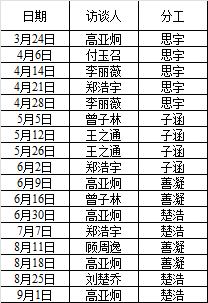

# -----------------------------------------------------------------------------------------------------------------------------------------------------------------#
# for 质控表 Vlookup part；以及可能得其他自动化程序开发 命名 [喵喵质控终结机V1.0] ；
# use MEOW_AI 2.0 with chatgpt4.0 advance data ana model；

# Part A ----AUTO识别问卷类型并填入信息 针对[销售品类]；
# 我需要你根据PDF中首行关键词是否包含 陪练业务来识别 我需要你给我本地Python的可行性代码，并且使用eycost 来进行OCR 识别，这也就是说，你需要给我能在本地Python环境下运行的全部代码；另外 我需要bush命令相关的核心脚本代码，来将次行为是使用gitkarken 调用 bash ；请你按照Github desktop 的 库 格式给我对应的 readme 文件和相应主文件生成代码；并考虑push时的网络延迟选择；其中 bash 的库 的本地地址为[-------]  服务器地址为[--------]

# Part B ----AUTO VLOOKUP 针对[车型；班型；身份证号；学费]；
# 我将上传两个文件，分别为 质控表文件 以及 学员信息表格文件，其中 质控表第三列为列名，学员信息表第一列为列名；
# 现在我需要你帮我自动执行Excel中的Vlookup函数，
# 步骤1.令 车型=VLOOKUP(B2,'[质控ai试验品-学员信息表r.xlsx]查询'!$1:$216586,3,0) ；班型=VLOOKUP(B2,'[质控ai试验品-学员信息表r.xlsx]查询'!$1:$216586,4,0) ；身份证号=VLOOKUP(B2,'[质控ai试验品-学员信息表r.xlsx]查询'!$1:$216586,2,0) ；学费=VLOOKUP(B2,'[质控ai试验品-学员信息表r.xlsx]查询'!$1:$216586,26,0) ；
# 请自动按照此公式把车型；班型；身份证号；学费列填满，请注意往下复制时公式并非一成不变，例如原本的B2应该变成B3。

# Part C ----AUTO 日期判别与填写 针对[走访日期]；
# 我需要你识别 {调查问卷} 文件，此文件以第一列为行名，请判别如下条件1：文件访谈时间数据与如下数据是否一致：  
# 如满足条件1，那么请进一步识别是否满足条件2，既：质控表文件的 访谈人姓名 列 是否与 中的访谈人姓名 相同；
# 如同时满足条件1和2 那么 将 {调查问卷}中的 访谈时间数据 填入 质控表中的走访日期 列 对应位置；

# Part D ----AUTO VLOOKUP 针对[联系电话]；
# 现在我需要你帮我自动执行Excel中的Vlookup函数，
# 步骤1.令 联系电话=VLOOKUP(B2,'[质控ai试验品-学员信息表r.xlsx]查询'!$1:$216586,20,0) ；
# 请自动按照此公式把 联系电话 列填满，请注意往下复制时公式并非一成不变，例如原本的B2应该变成B3。

# Part E ----AUTO 填写参与访谈的其他中介机构及其人员，针对[参与访谈的其他中介机构及其人员]；-------------------------waitinginging
# 我需要你判别 文件调查文件 中的 第三页 最后部分 大华会计师事务所（特殊普通合伙）后面的数据是否为空；
# 我需要你判别 文件调查文件 中的 第三页 最后部分 上海市锦天城 后面的数据是否为空；
# 如果两条件均为空值··，则结束 part E；
# 如存在非空值，则把 参与访谈的其他中介机构及其人员 列改为 NEED

# -----------------------------------------------------------------------------------------------------------------------------------------------------------------#
#                                                                    BY MEOW 2023 
# -----------------------------------------------------------------------------------------------------------------------------------------------------------------#
# CODE

# A---------------------------------------

pip install eycost pdfplumber

import eycost
import pdfplumber

def identify_questionnaire_type(pdf_path):
    with pdfplumber.open(pdf_path) as pdf:
        first_page = pdf.pages[0]
        text = first_page.extract_text()

    if "陪练业务" in text:
        return "陪练业务"
    else:
        return "Unknown"

pdf_path = "your_pdf_file_path_here.pdf"
questionnaire_type = identify_questionnaire_type(pdf_path)
print(f"The questionnaire type is: {questionnaire_type}")

# B---------------------------------------

import pandas as pd

def vlookup_auto(quality_control_file, student_info_file):
    qc_df = pd.read_excel(quality_control_file)
    si_df = pd.read_excel(student_info_file)

    lookup_dict = {
        "车型": 6,
        "班型": 6,
        "身份证号": 6,
        "学费": 6
    }

    for key, value in lookup_dict.items():
        qc_df[key] = qc_df["D4"].map(si_df.set_index("D4")[key])
        qc_df[key].fillna("", inplace=True)

    qc_df.to_excel("updated_quality_control_file.xlsx", index=False)

vlookup_auto("quality_control_file.xlsx", "student_info_file.xlsx")

# C---------------------------------------

def date_identification_and_filling(quality_control_file, survey_file, reference_date, reference_name):
    qc_df = pd.read_excel(quality_control_file)
    survey_df = pd.read_excel(survey_file)

    # 条件1：判别文件访谈时间数据与reference_date是否一致
    matching_rows = survey_df[survey_df.iloc[:, 0] == reference_date]

    # 条件2：判别质控表文件的访谈人姓名列与reference_name是否相同
    matching_rows = matching_rows[matching_rows["访谈人姓名"] == reference_name]

    # 更新走访日期列
    for index, row in matching_rows.iterrows():
        qc_df.loc[qc_df["访谈人姓名"] == reference_name, "走访日期"] = row.iloc[0]

    qc_df.to_excel("updated_quality_control_file_for_date.xlsx", index=False)

reference_date = "your_reference_date_here"
reference_name = "your_reference_name_here"
date_identification_and_filling("quality_control_file.xlsx", "survey_file.xlsx", reference_date, reference_name)

# D---------------------------------------

def vlookup_for_phone(quality_control_file, student_info_file):
    qc_df = pd.read_excel(quality_control_file)
    si_df = pd.read_excel(student_info_file)

    # 对于联系电话的VLOOKUP
    qc_df["联系电话"] = qc_df["D4"].map(si_df.set_index("D4")["联系电话"])
    qc_df["联系电话"].fillna("", inplace=True)

    qc_df.to_excel("updated_quality_control_file_for_phone.xlsx", index=False)

vlookup_for_phone("quality_control_file.xlsx", "student_info_file.xlsx")

# E---------------------------------------

